# Projects and dependencies analysis

This document provides a comprehensive overview of the projects and their dependencies in the context of upgrading to .NETCoreApp,Version=v10.0.

## Table of Contents

- [Executive Summary](#executive-Summary)
  - [Highlevel Metrics](#highlevel-metrics)
  - [Projects Compatibility](#projects-compatibility)
  - [Package Compatibility](#package-compatibility)
  - [API Compatibility](#api-compatibility)
- [Aggregate NuGet packages details](#aggregate-nuget-packages-details)
- [Top API Migration Challenges](#top-api-migration-challenges)
  - [Technologies and Features](#technologies-and-features)
  - [Most Frequent API Issues](#most-frequent-api-issues)
- [Projects Relationship Graph](#projects-relationship-graph)
- [Project Details](#project-details)

  - [CleanArchitecture.Application.UnitTests\CleanArchitecture.Application.UnitTests.csproj](#cleanarchitectureapplicationunittestscleanarchitectureapplicationunittestscsproj)
  - [CleanArchitecture.Application\CleanArchitecture.Application.csproj](#cleanarchitectureapplicationcleanarchitectureapplicationcsproj)
  - [CleanArchitecture.ArchitectureTests\CleanArchitecture.ArchitectureTests.csproj](#cleanarchitecturearchitecturetestscleanarchitecturearchitecturetestscsproj)
  - [CleanArchitecture.Contracts\CleanArchitecture.Contracts.csproj](#cleanarchitecturecontractscleanarchitecturecontractscsproj)
  - [CleanArchitecture.Domain.UnitTests\CleanArchitecture.Domain.UnitTests.csproj](#cleanarchitecturedomainunittestscleanarchitecturedomainunittestscsproj)
  - [CleanArchitecture.Domain\CleanArchitecture.Domain.csproj](#cleanarchitecturedomaincleanarchitecturedomaincsproj)
  - [CleanArchitecture.Infrastructure.Composition\CleanArchitecture.Infrastructure.Composition.csproj](#cleanarchitectureinfrastructurecompositioncleanarchitectureinfrastructurecompositioncsproj)
  - [CleanArchitecture.Infrastructure.EfCore.Sqlite.IntegrationTests\CleanArchitecture.Infrastructure.EfCore.Sqlite.IntegrationTests.csproj](#cleanarchitectureinfrastructureefcoresqliteintegrationtestscleanarchitectureinfrastructureefcoresqliteintegrationtestscsproj)
  - [CleanArchitecture.Infrastructure.EfCore.Sqlite\CleanArchitecture.Infrastructure.EfCore.Sqlite.csproj](#cleanarchitectureinfrastructureefcoresqlitecleanarchitectureinfrastructureefcoresqlitecsproj)
  - [CleanArchitecture.Infrastructure.InMemory.IntegrationTests\CleanArchitecture.Infrastructure.InMemory.IntegrationTests.csproj](#cleanarchitectureinfrastructureinmemoryintegrationtestscleanarchitectureinfrastructureinmemoryintegrationtestscsproj)
  - [CleanArchitecture.Infrastructure.InMemory\CleanArchitecture.Infrastructure.InMemory.csproj](#cleanarchitectureinfrastructureinmemorycleanarchitectureinfrastructureinmemorycsproj)
  - [CleanArchitecture.Presentation.BlazorWebApp\CleanArchitecture.Presentation.BlazorWebApp.csproj](#cleanarchitecturepresentationblazorwebappcleanarchitecturepresentationblazorwebappcsproj)
  - [CleanArchitecture.Presentation.Wpf.UnitTests\CleanArchitecture.Presentation.Wpf.UnitTests.csproj](#cleanarchitecturepresentationwpfunittestscleanarchitecturepresentationwpfunittestscsproj)
  - [CleanArchitecture.Presentation.Wpf\CleanArchitecture.Presentation.Wpf.csproj](#cleanarchitecturepresentationwpfcleanarchitecturepresentationwpfcsproj)

## Executive Summary

### Highlevel Metrics

| Metric | Count | Status |
| :--- | :---: | :--- |
| Total Projects | 14 | All require upgrade |
| Total NuGet Packages | 20 | 10 need upgrade |
| Total Code Files | 90 |  |
| Total Code Files with Incidents | 25 |  |
| Total Lines of Code | 3212 |  |
| Total Number of Issues | 79 |  |
| Estimated LOC to modify | 53+ | at least 1,7% of codebase |

### Projects Compatibility

| Project | Target Framework | Difficulty | Package Issues | API Issues | Est. LOC Impact | Description |
| :--- | :---: | :---: | :---: | :---: | :---: | :--- |
| [CleanArchitecture.Application.UnitTests\CleanArchitecture.Application.UnitTests.csproj](#cleanarchitectureapplicationunittestscleanarchitectureapplicationunittestscsproj) | net8.0 | 🟢 Low | 0 | 0 |  | DotNetCoreApp, Sdk Style = True |
| [CleanArchitecture.Application\CleanArchitecture.Application.csproj](#cleanarchitectureapplicationcleanarchitectureapplicationcsproj) | net8.0 | 🟢 Low | 1 | 0 |  | ClassLibrary, Sdk Style = True |
| [CleanArchitecture.ArchitectureTests\CleanArchitecture.ArchitectureTests.csproj](#cleanarchitecturearchitecturetestscleanarchitecturearchitecturetestscsproj) | net8.0-windows | 🟢 Low | 0 | 0 |  | DotNetCoreApp, Sdk Style = True |
| [CleanArchitecture.Contracts\CleanArchitecture.Contracts.csproj](#cleanarchitecturecontractscleanarchitecturecontractscsproj) | net8.0 | 🟢 Low | 0 | 0 |  | ClassLibrary, Sdk Style = True |
| [CleanArchitecture.Domain.UnitTests\CleanArchitecture.Domain.UnitTests.csproj](#cleanarchitecturedomainunittestscleanarchitecturedomainunittestscsproj) | net8.0 | 🟢 Low | 0 | 0 |  | DotNetCoreApp, Sdk Style = True |
| [CleanArchitecture.Domain\CleanArchitecture.Domain.csproj](#cleanarchitecturedomaincleanarchitecturedomaincsproj) | net8.0 | 🟢 Low | 0 | 0 |  | ClassLibrary, Sdk Style = True |
| [CleanArchitecture.Infrastructure.Composition\CleanArchitecture.Infrastructure.Composition.csproj](#cleanarchitectureinfrastructurecompositioncleanarchitectureinfrastructurecompositioncsproj) | net8.0 | 🟢 Low | 0 | 0 |  | ClassLibrary, Sdk Style = True |
| [CleanArchitecture.Infrastructure.EfCore.Sqlite.IntegrationTests\CleanArchitecture.Infrastructure.EfCore.Sqlite.IntegrationTests.csproj](#cleanarchitectureinfrastructureefcoresqliteintegrationtestscleanarchitectureinfrastructureefcoresqliteintegrationtestscsproj) | net8.0 | 🟢 Low | 2 | 0 |  | DotNetCoreApp, Sdk Style = True |
| [CleanArchitecture.Infrastructure.EfCore.Sqlite\CleanArchitecture.Infrastructure.EfCore.Sqlite.csproj](#cleanarchitectureinfrastructureefcoresqlitecleanarchitectureinfrastructureefcoresqlitecsproj) | net8.0 | 🟢 Low | 4 | 0 |  | ClassLibrary, Sdk Style = True |
| [CleanArchitecture.Infrastructure.InMemory.IntegrationTests\CleanArchitecture.Infrastructure.InMemory.IntegrationTests.csproj](#cleanarchitectureinfrastructureinmemoryintegrationtestscleanarchitectureinfrastructureinmemoryintegrationtestscsproj) | net8.0 | 🟢 Low | 2 | 0 |  | DotNetCoreApp, Sdk Style = True |
| [CleanArchitecture.Infrastructure.InMemory\CleanArchitecture.Infrastructure.InMemory.csproj](#cleanarchitectureinfrastructureinmemorycleanarchitectureinfrastructureinmemorycsproj) | net8.0 | 🟢 Low | 1 | 0 |  | ClassLibrary, Sdk Style = True |
| [CleanArchitecture.Presentation.BlazorWebApp\CleanArchitecture.Presentation.BlazorWebApp.csproj](#cleanarchitecturepresentationblazorwebappcleanarchitecturepresentationblazorwebappcsproj) | net8.0 | 🟢 Low | 0 | 1 | 1+ | AspNetCore, Sdk Style = True |
| [CleanArchitecture.Presentation.Wpf.UnitTests\CleanArchitecture.Presentation.Wpf.UnitTests.csproj](#cleanarchitecturepresentationwpfunittestscleanarchitecturepresentationwpfunittestscsproj) | net8.0-windows | 🟢 Low | 0 | 0 |  | DotNetCoreApp, Sdk Style = True |
| [CleanArchitecture.Presentation.Wpf\CleanArchitecture.Presentation.Wpf.csproj](#cleanarchitecturepresentationwpfcleanarchitecturepresentationwpfcsproj) | net8.0-windows | 🟡 Medium | 2 | 52 | 52+ | Wpf, Sdk Style = True |

### Package Compatibility

| Status | Count | Percentage |
| :--- | :---: | :---: |
| ✅ Compatible | 10 | 50,0% |
| ⚠️ Incompatible | 0 | 0,0% |
| 🔄 Upgrade Recommended | 10 | 50,0% |
| ***Total NuGet Packages*** | ***20*** | ***100%*** |

### API Compatibility

| Category | Count | Impact |
| :--- | :---: | :--- |
| 🔴 Binary Incompatible | 46 | High - Require code changes |
| 🟡 Source Incompatible | 0 | Medium - Needs re-compilation and potential conflicting API error fixing |
| 🔵 Behavioral change | 7 | Low - Behavioral changes that may require testing at runtime |
| ✅ Compatible | 4199 |  |
| ***Total APIs Analyzed*** | ***4252*** |  |

## Aggregate NuGet packages details

| Package | Current Version | Suggested Version | Projects | Description |
| :--- | :---: | :---: | :--- | :--- |
| coverlet.collector | 6.0.0 |  | [CleanArchitecture.Application.UnitTests.csproj](#cleanarchitectureapplicationunittestscleanarchitectureapplicationunittestscsproj) [CleanArchitecture.Domain.UnitTests.csproj](#cleanarchitecturedomainunittestscleanarchitecturedomainunittestscsproj) [CleanArchitecture.Infrastructure.InMemory.IntegrationTests.csproj](#cleanarchitectureinfrastructureinmemoryintegrationtestscleanarchitectureinfrastructureinmemoryintegrationtestscsproj) | ✅Compatible |
| coverlet.collector | 6.0.2 |  | [CleanArchitecture.ArchitectureTests.csproj](#cleanarchitecturearchitecturetestscleanarchitecturearchitecturetestscsproj) [CleanArchitecture.Infrastructure.EfCore.Sqlite.IntegrationTests.csproj](#cleanarchitectureinfrastructureefcoresqliteintegrationtestscleanarchitectureinfrastructureefcoresqliteintegrationtestscsproj) [CleanArchitecture.Presentation.Wpf.UnitTests.csproj](#cleanarchitecturepresentationwpfunittestscleanarchitecturepresentationwpfunittestscsproj) | ✅Compatible |
| FakeItEasy | 8.3.0 |  | [CleanArchitecture.Application.UnitTests.csproj](#cleanarchitectureapplicationunittestscleanarchitectureapplicationunittestscsproj) [CleanArchitecture.Infrastructure.InMemory.IntegrationTests.csproj](#cleanarchitectureinfrastructureinmemoryintegrationtestscleanarchitectureinfrastructureinmemoryintegrationtestscsproj) [CleanArchitecture.Presentation.Wpf.UnitTests.csproj](#cleanarchitecturepresentationwpfunittestscleanarchitecturepresentationwpfunittestscsproj) | ✅Compatible |
| Microsoft.EntityFrameworkCore | 8.0.8 | 10.0.3 | [CleanArchitecture.Infrastructure.EfCore.Sqlite.csproj](#cleanarchitectureinfrastructureefcoresqlitecleanarchitectureinfrastructureefcoresqlitecsproj) | NuGet package upgrade is recommended |
| Microsoft.EntityFrameworkCore.Sqlite | 8.0.8 | 10.0.3 | [CleanArchitecture.Infrastructure.EfCore.Sqlite.csproj](#cleanarchitectureinfrastructureefcoresqlitecleanarchitectureinfrastructureefcoresqlitecsproj) | NuGet package upgrade is recommended |
| Microsoft.Extensions.Configuration | 8.0.0 | 10.0.3 | [CleanArchitecture.Infrastructure.EfCore.Sqlite.IntegrationTests.csproj](#cleanarchitectureinfrastructureefcoresqliteintegrationtestscleanarchitectureinfrastructureefcoresqliteintegrationtestscsproj) [CleanArchitecture.Infrastructure.InMemory.IntegrationTests.csproj](#cleanarchitectureinfrastructureinmemoryintegrationtestscleanarchitectureinfrastructureinmemoryintegrationtestscsproj) | NuGet package upgrade is recommended |
| Microsoft.Extensions.Configuration.Binder | 8.0.2 | 10.0.3 | [CleanArchitecture.Infrastructure.EfCore.Sqlite.IntegrationTests.csproj](#cleanarchitectureinfrastructureefcoresqliteintegrationtestscleanarchitectureinfrastructureefcoresqliteintegrationtestscsproj) | NuGet package upgrade is recommended |
| Microsoft.Extensions.DependencyInjection | 8.0.0 | 10.0.3 | [CleanArchitecture.Presentation.Wpf.csproj](#cleanarchitecturepresentationwpfcleanarchitecturepresentationwpfcsproj) | NuGet package upgrade is recommended |
| Microsoft.Extensions.DependencyInjection | 8.0.1 | 10.0.3 | [CleanArchitecture.Infrastructure.InMemory.IntegrationTests.csproj](#cleanarchitectureinfrastructureinmemoryintegrationtestscleanarchitectureinfrastructureinmemoryintegrationtestscsproj) | NuGet package upgrade is recommended |
| Microsoft.Extensions.DependencyInjection.Abstractions | 8.0.2 | 10.0.3 | [CleanArchitecture.Application.csproj](#cleanarchitectureapplicationcleanarchitectureapplicationcsproj) [CleanArchitecture.Infrastructure.InMemory.csproj](#cleanarchitectureinfrastructureinmemorycleanarchitectureinfrastructureinmemorycsproj) | NuGet package upgrade is recommended |
| Microsoft.Extensions.Hosting | 8.0.0 | 10.0.3 | [CleanArchitecture.Presentation.Wpf.csproj](#cleanarchitecturepresentationwpfcleanarchitecturepresentationwpfcsproj) | NuGet package upgrade is recommended |
| Microsoft.Extensions.Hosting.Abstractions | 8.0.0 | 10.0.3 | [CleanArchitecture.Infrastructure.EfCore.Sqlite.csproj](#cleanarchitectureinfrastructureefcoresqlitecleanarchitectureinfrastructureefcoresqlitecsproj) | NuGet package upgrade is recommended |
| Microsoft.Extensions.Options.ConfigurationExtensions | 8.0.0 | 10.0.3 | [CleanArchitecture.Infrastructure.EfCore.Sqlite.csproj](#cleanarchitectureinfrastructureefcoresqlitecleanarchitectureinfrastructureefcoresqlitecsproj) | NuGet package upgrade is recommended |
| Microsoft.NET.Test.Sdk | 17.11.1 |  | [CleanArchitecture.ArchitectureTests.csproj](#cleanarchitecturearchitecturetestscleanarchitecturearchitecturetestscsproj) [CleanArchitecture.Infrastructure.EfCore.Sqlite.IntegrationTests.csproj](#cleanarchitectureinfrastructureefcoresqliteintegrationtestscleanarchitectureinfrastructureefcoresqliteintegrationtestscsproj) [CleanArchitecture.Presentation.Wpf.UnitTests.csproj](#cleanarchitecturepresentationwpfunittestscleanarchitecturepresentationwpfunittestscsproj) | ✅Compatible |
| Microsoft.NET.Test.Sdk | 17.8.0 |  | [CleanArchitecture.Application.UnitTests.csproj](#cleanarchitectureapplicationunittestscleanarchitectureapplicationunittestscsproj) [CleanArchitecture.Domain.UnitTests.csproj](#cleanarchitecturedomainunittestscleanarchitecturedomainunittestscsproj) [CleanArchitecture.Infrastructure.InMemory.IntegrationTests.csproj](#cleanarchitectureinfrastructureinmemoryintegrationtestscleanarchitectureinfrastructureinmemoryintegrationtestscsproj) | ✅Compatible |
| NetArchTest.Rules | 1.3.2 |  | [CleanArchitecture.ArchitectureTests.csproj](#cleanarchitecturearchitecturetestscleanarchitecturearchitecturetestscsproj) | ✅Compatible |
| xunit | 2.5.3 |  | [CleanArchitecture.Application.UnitTests.csproj](#cleanarchitectureapplicationunittestscleanarchitectureapplicationunittestscsproj) [CleanArchitecture.Domain.UnitTests.csproj](#cleanarchitecturedomainunittestscleanarchitecturedomainunittestscsproj) [CleanArchitecture.Infrastructure.InMemory.IntegrationTests.csproj](#cleanarchitectureinfrastructureinmemoryintegrationtestscleanarchitectureinfrastructureinmemoryintegrationtestscsproj) | ✅Compatible |
| xunit | 2.9.2 |  | [CleanArchitecture.ArchitectureTests.csproj](#cleanarchitecturearchitecturetestscleanarchitecturearchitecturetestscsproj) [CleanArchitecture.Infrastructure.EfCore.Sqlite.IntegrationTests.csproj](#cleanarchitectureinfrastructureefcoresqliteintegrationtestscleanarchitectureinfrastructureefcoresqliteintegrationtestscsproj) [CleanArchitecture.Presentation.Wpf.UnitTests.csproj](#cleanarchitecturepresentationwpfunittestscleanarchitecturepresentationwpfunittestscsproj) | ✅Compatible |
| xunit.runner.visualstudio | 2.5.3 |  | [CleanArchitecture.Application.UnitTests.csproj](#cleanarchitectureapplicationunittestscleanarchitectureapplicationunittestscsproj) [CleanArchitecture.Domain.UnitTests.csproj](#cleanarchitecturedomainunittestscleanarchitecturedomainunittestscsproj) [CleanArchitecture.Infrastructure.InMemory.IntegrationTests.csproj](#cleanarchitectureinfrastructureinmemoryintegrationtestscleanarchitectureinfrastructureinmemoryintegrationtestscsproj) | ✅Compatible |
| xunit.runner.visualstudio | 2.8.2 |  | [CleanArchitecture.ArchitectureTests.csproj](#cleanarchitecturearchitecturetestscleanarchitecturearchitecturetestscsproj) [CleanArchitecture.Infrastructure.EfCore.Sqlite.IntegrationTests.csproj](#cleanarchitectureinfrastructureefcoresqliteintegrationtestscleanarchitectureinfrastructureefcoresqliteintegrationtestscsproj) [CleanArchitecture.Presentation.Wpf.UnitTests.csproj](#cleanarchitecturepresentationwpfunittestscleanarchitecturepresentationwpfunittestscsproj) | ✅Compatible |

## Top API Migration Challenges

### Technologies and Features

| Technology | Issues | Percentage | Migration Path |
| :--- | :---: | :---: | :--- |
| WPF (Windows Presentation Foundation) | 14 | 26,4% | WPF APIs for building Windows desktop applications with XAML-based UI that are available in .NET on Windows. WPF provides rich desktop UI capabilities with data binding and styling. Enable Windows Desktop support: Option 1 (Recommended): Target net9.0-windows; Option 2: Add <UseWindowsDesktop>true</UseWindowsDesktop>. |

### Most Frequent API Issues

| API | Count | Percentage | Category |
| :--- | :---: | :---: | :--- |
| T:System.Windows.Application | 4 | 7,5% | Binary Incompatible |
| E:System.Windows.Input.CommandManager.RequerySuggested | 4 | 7,5% | Binary Incompatible |
| M:System.Windows.Application.LoadComponent(System.Object,System.Uri) | 3 | 5,7% | Binary Incompatible |
| T:System.Uri | 3 | 5,7% | Behavioral Change |
| M:System.Uri.#ctor(System.String,System.UriKind) | 3 | 5,7% | Behavioral Change |
| T:System.Windows.Visibility | 3 | 5,7% | Binary Incompatible |
| T:System.Windows.RoutedEventHandler | 2 | 3,8% | Binary Incompatible |
| M:System.Windows.Controls.UserControl.#ctor | 2 | 3,8% | Binary Incompatible |
| T:System.Windows.Markup.IComponentConnector | 2 | 3,8% | Binary Incompatible |
| P:System.Windows.FrameworkElement.DataContext | 2 | 3,8% | Binary Incompatible |
| M:System.Windows.Window.#ctor | 2 | 3,8% | Binary Incompatible |
| M:Microsoft.AspNetCore.Builder.ExceptionHandlerExtensions.UseExceptionHandler(Microsoft.AspNetCore.Builder.IApplicationBuilder,System.String,System.Boolean) | 1 | 1,9% | Behavioral Change |
| M:System.Windows.Markup.InternalTypeHelper.#ctor | 1 | 1,9% | Binary Incompatible |
| T:System.Windows.Markup.InternalTypeHelper | 1 | 1,9% | Binary Incompatible |
| T:System.Windows.Data.IMultiValueConverter | 1 | 1,9% | Binary Incompatible |
| E:System.Windows.FrameworkElement.Loaded | 1 | 1,9% | Binary Incompatible |
| T:System.Windows.RoutedEventArgs | 1 | 1,9% | Binary Incompatible |
| M:System.Windows.Controls.Primitives.TextBoxBase.SelectAll | 1 | 1,9% | Binary Incompatible |
| M:System.Windows.UIElement.Focus | 1 | 1,9% | Binary Incompatible |
| F:System.Windows.Visibility.Visible | 1 | 1,9% | Binary Incompatible |
| P:System.Windows.UIElement.Visibility | 1 | 1,9% | Binary Incompatible |
| T:System.Windows.Markup.IStyleConnector | 1 | 1,9% | Binary Incompatible |
| T:System.Windows.Controls.UserControl | 1 | 1,9% | Binary Incompatible |
| T:System.Windows.MessageBox | 1 | 1,9% | Binary Incompatible |
| T:System.Windows.MessageBoxResult | 1 | 1,9% | Binary Incompatible |
| M:System.Windows.MessageBox.Show(System.String,System.String) | 1 | 1,9% | Binary Incompatible |
| M:System.Windows.Application.Run | 1 | 1,9% | Binary Incompatible |
| T:System.Windows.ExitEventArgs | 1 | 1,9% | Binary Incompatible |
| M:System.Windows.Application.OnExit(System.Windows.ExitEventArgs) | 1 | 1,9% | Binary Incompatible |
| T:System.Windows.StartupEventArgs | 1 | 1,9% | Binary Incompatible |
| M:System.Windows.Window.Show | 1 | 1,9% | Binary Incompatible |
| M:System.Windows.Application.OnStartup(System.Windows.StartupEventArgs) | 1 | 1,9% | Binary Incompatible |
| M:System.Windows.Application.#ctor | 1 | 1,9% | Binary Incompatible |
| T:System.Windows.Window | 1 | 1,9% | Binary Incompatible |

## Projects Relationship Graph

Legend:
📦 SDK-style project
⚙️ Classic project

```mermaid
flowchart LR
    P1["<b>📦&nbsp;CleanArchitecture.Application.UnitTests.csproj</b><br/><small>net8.0</small>"]
    P2["<b>📦&nbsp;CleanArchitecture.Application.csproj</b><br/><small>net8.0</small>"]
    P3["<b>📦&nbsp;CleanArchitecture.ArchitectureTests.csproj</b><br/><small>net8.0-windows</small>"]
    P4["<b>📦&nbsp;CleanArchitecture.Contracts.csproj</b><br/><small>net8.0</small>"]
    P5["<b>📦&nbsp;CleanArchitecture.Domain.UnitTests.csproj</b><br/><small>net8.0</small>"]
    P6["<b>📦&nbsp;CleanArchitecture.Domain.csproj</b><br/><small>net8.0</small>"]
    P7["<b>📦&nbsp;CleanArchitecture.Infrastructure.Composition.csproj</b><br/><small>net8.0</small>"]
    P8["<b>📦&nbsp;CleanArchitecture.Infrastructure.EfCore.Sqlite.IntegrationTests.csproj</b><br/><small>net8.0</small>"]
    P9["<b>📦&nbsp;CleanArchitecture.Infrastructure.EfCore.Sqlite.csproj</b><br/><small>net8.0</small>"]
    P10["<b>📦&nbsp;CleanArchitecture.Infrastructure.InMemory.IntegrationTests.csproj</b><br/><small>net8.0</small>"]
    P11["<b>📦&nbsp;CleanArchitecture.Infrastructure.InMemory.csproj</b><br/><small>net8.0</small>"]
    P12["<b>📦&nbsp;CleanArchitecture.Presentation.BlazorWebApp.csproj</b><br/><small>net8.0</small>"]
    P13["<b>📦&nbsp;CleanArchitecture.Presentation.Wpf.UnitTests.csproj</b><br/><small>net8.0-windows</small>"]
    P14["<b>📦&nbsp;CleanArchitecture.Presentation.Wpf.csproj</b><br/><small>net8.0-windows</small>"]
    P1 --> P2
    P2 --> P6
    P3 --> P7
    P3 --> P2
    P3 --> P6
    P3 --> P12
    P3 --> P14
    P5 --> P6
    P7 --> P9
    P7 --> P4
    P7 --> P11
    P8 --> P2
    P8 --> P9
    P8 --> P6
    P8 --> P4
    P9 --> P2
    P9 --> P6
    P9 --> P4
    P10 --> P11
    P11 --> P2
    P12 --> P2
    P12 --> P7
    P13 --> P7
    P13 --> P2
    P13 --> P14
    P14 --> P2
    P14 --> P7
    click P1 "#cleanarchitectureapplicationunittestscleanarchitectureapplicationunittestscsproj"
    click P2 "#cleanarchitectureapplicationcleanarchitectureapplicationcsproj"
    click P3 "#cleanarchitecturearchitecturetestscleanarchitecturearchitecturetestscsproj"
    click P4 "#cleanarchitecturecontractscleanarchitecturecontractscsproj"
    click P5 "#cleanarchitecturedomainunittestscleanarchitecturedomainunittestscsproj"
    click P6 "#cleanarchitecturedomaincleanarchitecturedomaincsproj"
    click P7 "#cleanarchitectureinfrastructurecompositioncleanarchitectureinfrastructurecompositioncsproj"
    click P8 "#cleanarchitectureinfrastructureefcoresqliteintegrationtestscleanarchitectureinfrastructureefcoresqliteintegrationtestscsproj"
    click P9 "#cleanarchitectureinfrastructureefcoresqlitecleanarchitectureinfrastructureefcoresqlitecsproj"
    click P10 "#cleanarchitectureinfrastructureinmemoryintegrationtestscleanarchitectureinfrastructureinmemoryintegrationtestscsproj"
    click P11 "#cleanarchitectureinfrastructureinmemorycleanarchitectureinfrastructureinmemorycsproj"
    click P12 "#cleanarchitecturepresentationblazorwebappcleanarchitecturepresentationblazorwebappcsproj"
    click P13 "#cleanarchitecturepresentationwpfunittestscleanarchitecturepresentationwpfunittestscsproj"
    click P14 "#cleanarchitecturepresentationwpfcleanarchitecturepresentationwpfcsproj"

```

## Project Details

### CleanArchitecture.Application.UnitTests\CleanArchitecture.Application.UnitTests.csproj

#### Project Info

- **Current Target Framework:** net8.0
- **Proposed Target Framework:** net10.0
- **SDK-style**: True
- **Project Kind:** DotNetCoreApp
- **Dependencies**: 1
- **Dependants**: 0
- **Number of Files**: 4
- **Number of Files with Incidents**: 1
- **Lines of Code**: 184
- **Estimated LOC to modify**: 0+ (at least 0,0% of the project)

#### Dependency Graph

Legend:
📦 SDK-style project
⚙️ Classic project

```mermaid
flowchart TB
    subgraph current["CleanArchitecture.Application.UnitTests.csproj"]
        MAIN["<b>📦&nbsp;CleanArchitecture.Application.UnitTests.csproj</b><br/><small>net8.0</small>"]
        click MAIN "#cleanarchitectureapplicationunittestscleanarchitectureapplicationunittestscsproj"
    end
    subgraph downstream["Dependencies (1"]
        P2["<b>📦&nbsp;CleanArchitecture.Application.csproj</b><br/><small>net8.0</small>"]
        click P2 "#cleanarchitectureapplicationcleanarchitectureapplicationcsproj"
    end
    MAIN --> P2

```

### API Compatibility

| Category | Count | Impact |
| :--- | :---: | :--- |
| 🔴 Binary Incompatible | 0 | High - Require code changes |
| 🟡 Source Incompatible | 0 | Medium - Needs re-compilation and potential conflicting API error fixing |
| 🔵 Behavioral change | 0 | Low - Behavioral changes that may require testing at runtime |
| ✅ Compatible | 381 |  |
| ***Total APIs Analyzed*** | ***381*** |  |

### CleanArchitecture.Application\CleanArchitecture.Application.csproj

#### Project Info

- **Current Target Framework:** net8.0
- **Proposed Target Framework:** net10.0
- **SDK-style**: True
- **Project Kind:** ClassLibrary
- **Dependencies**: 1
- **Dependants**: 8
- **Number of Files**: 25
- **Number of Files with Incidents**: 1
- **Lines of Code**: 610
- **Estimated LOC to modify**: 0+ (at least 0,0% of the project)

#### Dependency Graph

Legend:
📦 SDK-style project
⚙️ Classic project

```mermaid
flowchart TB
    subgraph upstream["Dependants (8)"]
        P1["<b>📦&nbsp;CleanArchitecture.Application.UnitTests.csproj</b><br/><small>net8.0</small>"]
        P3["<b>📦&nbsp;CleanArchitecture.ArchitectureTests.csproj</b><br/><small>net8.0-windows</small>"]
        P8["<b>📦&nbsp;CleanArchitecture.Infrastructure.EfCore.Sqlite.IntegrationTests.csproj</b><br/><small>net8.0</small>"]
        P9["<b>📦&nbsp;CleanArchitecture.Infrastructure.EfCore.Sqlite.csproj</b><br/><small>net8.0</small>"]
        P11["<b>📦&nbsp;CleanArchitecture.Infrastructure.InMemory.csproj</b><br/><small>net8.0</small>"]
        P12["<b>📦&nbsp;CleanArchitecture.Presentation.BlazorWebApp.csproj</b><br/><small>net8.0</small>"]
        P13["<b>📦&nbsp;CleanArchitecture.Presentation.Wpf.UnitTests.csproj</b><br/><small>net8.0-windows</small>"]
        P14["<b>📦&nbsp;CleanArchitecture.Presentation.Wpf.csproj</b><br/><small>net8.0-windows</small>"]
        click P1 "#cleanarchitectureapplicationunittestscleanarchitectureapplicationunittestscsproj"
        click P3 "#cleanarchitecturearchitecturetestscleanarchitecturearchitecturetestscsproj"
        click P8 "#cleanarchitectureinfrastructureefcoresqliteintegrationtestscleanarchitectureinfrastructureefcoresqliteintegrationtestscsproj"
        click P9 "#cleanarchitectureinfrastructureefcoresqlitecleanarchitectureinfrastructureefcoresqlitecsproj"
        click P11 "#cleanarchitectureinfrastructureinmemorycleanarchitectureinfrastructureinmemorycsproj"
        click P12 "#cleanarchitecturepresentationblazorwebappcleanarchitecturepresentationblazorwebappcsproj"
        click P13 "#cleanarchitecturepresentationwpfunittestscleanarchitecturepresentationwpfunittestscsproj"
        click P14 "#cleanarchitecturepresentationwpfcleanarchitecturepresentationwpfcsproj"
    end
    subgraph current["CleanArchitecture.Application.csproj"]
        MAIN["<b>📦&nbsp;CleanArchitecture.Application.csproj</b><br/><small>net8.0</small>"]
        click MAIN "#cleanarchitectureapplicationcleanarchitectureapplicationcsproj"
    end
    subgraph downstream["Dependencies (1"]
        P6["<b>📦&nbsp;CleanArchitecture.Domain.csproj</b><br/><small>net8.0</small>"]
        click P6 "#cleanarchitecturedomaincleanarchitecturedomaincsproj"
    end
    P1 --> MAIN
    P3 --> MAIN
    P8 --> MAIN
    P9 --> MAIN
    P11 --> MAIN
    P12 --> MAIN
    P13 --> MAIN
    P14 --> MAIN
    MAIN --> P6

```

### API Compatibility

| Category | Count | Impact |
| :--- | :---: | :--- |
| 🔴 Binary Incompatible | 0 | High - Require code changes |
| 🟡 Source Incompatible | 0 | Medium - Needs re-compilation and potential conflicting API error fixing |
| 🔵 Behavioral change | 0 | Low - Behavioral changes that may require testing at runtime |
| ✅ Compatible | 404 |  |
| ***Total APIs Analyzed*** | ***404*** |  |

### CleanArchitecture.ArchitectureTests\CleanArchitecture.ArchitectureTests.csproj

#### Project Info

- **Current Target Framework:** net8.0-windows
- **Proposed Target Framework:** net10.0--windows
- **SDK-style**: True
- **Project Kind:** DotNetCoreApp
- **Dependencies**: 5
- **Dependants**: 0
- **Number of Files**: 7
- **Number of Files with Incidents**: 1
- **Lines of Code**: 179
- **Estimated LOC to modify**: 0+ (at least 0,0% of the project)

#### Dependency Graph

Legend:
📦 SDK-style project
⚙️ Classic project

```mermaid
flowchart TB
    subgraph current["CleanArchitecture.ArchitectureTests.csproj"]
        MAIN["<b>📦&nbsp;CleanArchitecture.ArchitectureTests.csproj</b><br/><small>net8.0-windows</small>"]
        click MAIN "#cleanarchitecturearchitecturetestscleanarchitecturearchitecturetestscsproj"
    end
    subgraph downstream["Dependencies (5"]
        P7["<b>📦&nbsp;CleanArchitecture.Infrastructure.Composition.csproj</b><br/><small>net8.0</small>"]
        P2["<b>📦&nbsp;CleanArchitecture.Application.csproj</b><br/><small>net8.0</small>"]
        P6["<b>📦&nbsp;CleanArchitecture.Domain.csproj</b><br/><small>net8.0</small>"]
        P12["<b>📦&nbsp;CleanArchitecture.Presentation.BlazorWebApp.csproj</b><br/><small>net8.0</small>"]
        P14["<b>📦&nbsp;CleanArchitecture.Presentation.Wpf.csproj</b><br/><small>net8.0-windows</small>"]
        click P7 "#cleanarchitectureinfrastructurecompositioncleanarchitectureinfrastructurecompositioncsproj"
        click P2 "#cleanarchitectureapplicationcleanarchitectureapplicationcsproj"
        click P6 "#cleanarchitecturedomaincleanarchitecturedomaincsproj"
        click P12 "#cleanarchitecturepresentationblazorwebappcleanarchitecturepresentationblazorwebappcsproj"
        click P14 "#cleanarchitecturepresentationwpfcleanarchitecturepresentationwpfcsproj"
    end
    MAIN --> P7
    MAIN --> P2
    MAIN --> P6
    MAIN --> P12
    MAIN --> P14

```

### API Compatibility

| Category | Count | Impact |
| :--- | :---: | :--- |
| 🔴 Binary Incompatible | 0 | High - Require code changes |
| 🟡 Source Incompatible | 0 | Medium - Needs re-compilation and potential conflicting API error fixing |
| 🔵 Behavioral change | 0 | Low - Behavioral changes that may require testing at runtime |
| ✅ Compatible | 275 |  |
| ***Total APIs Analyzed*** | ***275*** |  |

### CleanArchitecture.Contracts\CleanArchitecture.Contracts.csproj

#### Project Info

- **Current Target Framework:** net8.0
- **Proposed Target Framework:** net10.0
- **SDK-style**: True
- **Project Kind:** ClassLibrary
- **Dependencies**: 0
- **Dependants**: 3
- **Number of Files**: 2
- **Number of Files with Incidents**: 1
- **Lines of Code**: 31
- **Estimated LOC to modify**: 0+ (at least 0,0% of the project)

#### Dependency Graph

Legend:
📦 SDK-style project
⚙️ Classic project

```mermaid
flowchart TB
    subgraph upstream["Dependants (3)"]
        P7["<b>📦&nbsp;CleanArchitecture.Infrastructure.Composition.csproj</b><br/><small>net8.0</small>"]
        P8["<b>📦&nbsp;CleanArchitecture.Infrastructure.EfCore.Sqlite.IntegrationTests.csproj</b><br/><small>net8.0</small>"]
        P9["<b>📦&nbsp;CleanArchitecture.Infrastructure.EfCore.Sqlite.csproj</b><br/><small>net8.0</small>"]
        click P7 "#cleanarchitectureinfrastructurecompositioncleanarchitectureinfrastructurecompositioncsproj"
        click P8 "#cleanarchitectureinfrastructureefcoresqliteintegrationtestscleanarchitectureinfrastructureefcoresqliteintegrationtestscsproj"
        click P9 "#cleanarchitectureinfrastructureefcoresqlitecleanarchitectureinfrastructureefcoresqlitecsproj"
    end
    subgraph current["CleanArchitecture.Contracts.csproj"]
        MAIN["<b>📦&nbsp;CleanArchitecture.Contracts.csproj</b><br/><small>net8.0</small>"]
        click MAIN "#cleanarchitecturecontractscleanarchitecturecontractscsproj"
    end
    P7 --> MAIN
    P8 --> MAIN
    P9 --> MAIN

```

### API Compatibility

| Category | Count | Impact |
| :--- | :---: | :--- |
| 🔴 Binary Incompatible | 0 | High - Require code changes |
| 🟡 Source Incompatible | 0 | Medium - Needs re-compilation and potential conflicting API error fixing |
| 🔵 Behavioral change | 0 | Low - Behavioral changes that may require testing at runtime |
| ✅ Compatible | 6 |  |
| ***Total APIs Analyzed*** | ***6*** |  |

### CleanArchitecture.Domain.UnitTests\CleanArchitecture.Domain.UnitTests.csproj

#### Project Info

- **Current Target Framework:** net8.0
- **Proposed Target Framework:** net10.0
- **SDK-style**: True
- **Project Kind:** DotNetCoreApp
- **Dependencies**: 1
- **Dependants**: 0
- **Number of Files**: 3
- **Number of Files with Incidents**: 1
- **Lines of Code**: 98
- **Estimated LOC to modify**: 0+ (at least 0,0% of the project)

#### Dependency Graph

Legend:
📦 SDK-style project
⚙️ Classic project

```mermaid
flowchart TB
    subgraph current["CleanArchitecture.Domain.UnitTests.csproj"]
        MAIN["<b>📦&nbsp;CleanArchitecture.Domain.UnitTests.csproj</b><br/><small>net8.0</small>"]
        click MAIN "#cleanarchitecturedomainunittestscleanarchitecturedomainunittestscsproj"
    end
    subgraph downstream["Dependencies (1"]
        P6["<b>📦&nbsp;CleanArchitecture.Domain.csproj</b><br/><small>net8.0</small>"]
        click P6 "#cleanarchitecturedomaincleanarchitecturedomaincsproj"
    end
    MAIN --> P6

```

### API Compatibility

| Category | Count | Impact |
| :--- | :---: | :--- |
| 🔴 Binary Incompatible | 0 | High - Require code changes |
| 🟡 Source Incompatible | 0 | Medium - Needs re-compilation and potential conflicting API error fixing |
| 🔵 Behavioral change | 0 | Low - Behavioral changes that may require testing at runtime |
| ✅ Compatible | 101 |  |
| ***Total APIs Analyzed*** | ***101*** |  |

### CleanArchitecture.Domain\CleanArchitecture.Domain.csproj

#### Project Info

- **Current Target Framework:** net8.0
- **Proposed Target Framework:** net10.0
- **SDK-style**: True
- **Project Kind:** ClassLibrary
- **Dependencies**: 0
- **Dependants**: 5
- **Number of Files**: 12
- **Number of Files with Incidents**: 1
- **Lines of Code**: 356
- **Estimated LOC to modify**: 0+ (at least 0,0% of the project)

#### Dependency Graph

Legend:
📦 SDK-style project
⚙️ Classic project

```mermaid
flowchart TB
    subgraph upstream["Dependants (5)"]
        P2["<b>📦&nbsp;CleanArchitecture.Application.csproj</b><br/><small>net8.0</small>"]
        P3["<b>📦&nbsp;CleanArchitecture.ArchitectureTests.csproj</b><br/><small>net8.0-windows</small>"]
        P5["<b>📦&nbsp;CleanArchitecture.Domain.UnitTests.csproj</b><br/><small>net8.0</small>"]
        P8["<b>📦&nbsp;CleanArchitecture.Infrastructure.EfCore.Sqlite.IntegrationTests.csproj</b><br/><small>net8.0</small>"]
        P9["<b>📦&nbsp;CleanArchitecture.Infrastructure.EfCore.Sqlite.csproj</b><br/><small>net8.0</small>"]
        click P2 "#cleanarchitectureapplicationcleanarchitectureapplicationcsproj"
        click P3 "#cleanarchitecturearchitecturetestscleanarchitecturearchitecturetestscsproj"
        click P5 "#cleanarchitecturedomainunittestscleanarchitecturedomainunittestscsproj"
        click P8 "#cleanarchitectureinfrastructureefcoresqliteintegrationtestscleanarchitectureinfrastructureefcoresqliteintegrationtestscsproj"
        click P9 "#cleanarchitectureinfrastructureefcoresqlitecleanarchitectureinfrastructureefcoresqlitecsproj"
    end
    subgraph current["CleanArchitecture.Domain.csproj"]
        MAIN["<b>📦&nbsp;CleanArchitecture.Domain.csproj</b><br/><small>net8.0</small>"]
        click MAIN "#cleanarchitecturedomaincleanarchitecturedomaincsproj"
    end
    P2 --> MAIN
    P3 --> MAIN
    P5 --> MAIN
    P8 --> MAIN
    P9 --> MAIN

```

### API Compatibility

| Category | Count | Impact |
| :--- | :---: | :--- |
| 🔴 Binary Incompatible | 0 | High - Require code changes |
| 🟡 Source Incompatible | 0 | Medium - Needs re-compilation and potential conflicting API error fixing |
| 🔵 Behavioral change | 0 | Low - Behavioral changes that may require testing at runtime |
| ✅ Compatible | 235 |  |
| ***Total APIs Analyzed*** | ***235*** |  |

### CleanArchitecture.Infrastructure.Composition\CleanArchitecture.Infrastructure.Composition.csproj

#### Project Info

- **Current Target Framework:** net8.0
- **Proposed Target Framework:** net10.0
- **SDK-style**: True
- **Project Kind:** ClassLibrary
- **Dependencies**: 3
- **Dependants**: 4
- **Number of Files**: 1
- **Number of Files with Incidents**: 1
- **Lines of Code**: 28
- **Estimated LOC to modify**: 0+ (at least 0,0% of the project)

#### Dependency Graph

Legend:
📦 SDK-style project
⚙️ Classic project

```mermaid
flowchart TB
    subgraph upstream["Dependants (4)"]
        P3["<b>📦&nbsp;CleanArchitecture.ArchitectureTests.csproj</b><br/><small>net8.0-windows</small>"]
        P12["<b>📦&nbsp;CleanArchitecture.Presentation.BlazorWebApp.csproj</b><br/><small>net8.0</small>"]
        P13["<b>📦&nbsp;CleanArchitecture.Presentation.Wpf.UnitTests.csproj</b><br/><small>net8.0-windows</small>"]
        P14["<b>📦&nbsp;CleanArchitecture.Presentation.Wpf.csproj</b><br/><small>net8.0-windows</small>"]
        click P3 "#cleanarchitecturearchitecturetestscleanarchitecturearchitecturetestscsproj"
        click P12 "#cleanarchitecturepresentationblazorwebappcleanarchitecturepresentationblazorwebappcsproj"
        click P13 "#cleanarchitecturepresentationwpfunittestscleanarchitecturepresentationwpfunittestscsproj"
        click P14 "#cleanarchitecturepresentationwpfcleanarchitecturepresentationwpfcsproj"
    end
    subgraph current["CleanArchitecture.Infrastructure.Composition.csproj"]
        MAIN["<b>📦&nbsp;CleanArchitecture.Infrastructure.Composition.csproj</b><br/><small>net8.0</small>"]
        click MAIN "#cleanarchitectureinfrastructurecompositioncleanarchitectureinfrastructurecompositioncsproj"
    end
    subgraph downstream["Dependencies (3"]
        P9["<b>📦&nbsp;CleanArchitecture.Infrastructure.EfCore.Sqlite.csproj</b><br/><small>net8.0</small>"]
        P4["<b>📦&nbsp;CleanArchitecture.Contracts.csproj</b><br/><small>net8.0</small>"]
        P11["<b>📦&nbsp;CleanArchitecture.Infrastructure.InMemory.csproj</b><br/><small>net8.0</small>"]
        click P9 "#cleanarchitectureinfrastructureefcoresqlitecleanarchitectureinfrastructureefcoresqlitecsproj"
        click P4 "#cleanarchitecturecontractscleanarchitecturecontractscsproj"
        click P11 "#cleanarchitectureinfrastructureinmemorycleanarchitectureinfrastructureinmemorycsproj"
    end
    P3 --> MAIN
    P12 --> MAIN
    P13 --> MAIN
    P14 --> MAIN
    MAIN --> P9
    MAIN --> P4
    MAIN --> P11

```

### API Compatibility

| Category | Count | Impact |
| :--- | :---: | :--- |
| 🔴 Binary Incompatible | 0 | High - Require code changes |
| 🟡 Source Incompatible | 0 | Medium - Needs re-compilation and potential conflicting API error fixing |
| 🔵 Behavioral change | 0 | Low - Behavioral changes that may require testing at runtime |
| ✅ Compatible | 13 |  |
| ***Total APIs Analyzed*** | ***13*** |  |

### CleanArchitecture.Infrastructure.EfCore.Sqlite.IntegrationTests\CleanArchitecture.Infrastructure.EfCore.Sqlite.IntegrationTests.csproj

#### Project Info

- **Current Target Framework:** net8.0
- **Proposed Target Framework:** net10.0
- **SDK-style**: True
- **Project Kind:** DotNetCoreApp
- **Dependencies**: 4
- **Dependants**: 0
- **Number of Files**: 5
- **Number of Files with Incidents**: 1
- **Lines of Code**: 186
- **Estimated LOC to modify**: 0+ (at least 0,0% of the project)

#### Dependency Graph

Legend:
📦 SDK-style project
⚙️ Classic project

```mermaid
flowchart TB
    subgraph current["CleanArchitecture.Infrastructure.EfCore.Sqlite.IntegrationTests.csproj"]
        MAIN["<b>📦&nbsp;CleanArchitecture.Infrastructure.EfCore.Sqlite.IntegrationTests.csproj</b><br/><small>net8.0</small>"]
        click MAIN "#cleanarchitectureinfrastructureefcoresqliteintegrationtestscleanarchitectureinfrastructureefcoresqliteintegrationtestscsproj"
    end
    subgraph downstream["Dependencies (4"]
        P2["<b>📦&nbsp;CleanArchitecture.Application.csproj</b><br/><small>net8.0</small>"]
        P9["<b>📦&nbsp;CleanArchitecture.Infrastructure.EfCore.Sqlite.csproj</b><br/><small>net8.0</small>"]
        P6["<b>📦&nbsp;CleanArchitecture.Domain.csproj</b><br/><small>net8.0</small>"]
        P4["<b>📦&nbsp;CleanArchitecture.Contracts.csproj</b><br/><small>net8.0</small>"]
        click P2 "#cleanarchitectureapplicationcleanarchitectureapplicationcsproj"
        click P9 "#cleanarchitectureinfrastructureefcoresqlitecleanarchitectureinfrastructureefcoresqlitecsproj"
        click P6 "#cleanarchitecturedomaincleanarchitecturedomaincsproj"
        click P4 "#cleanarchitecturecontractscleanarchitecturecontractscsproj"
    end
    MAIN --> P2
    MAIN --> P9
    MAIN --> P6
    MAIN --> P4

```

### API Compatibility

| Category | Count | Impact |
| :--- | :---: | :--- |
| 🔴 Binary Incompatible | 0 | High - Require code changes |
| 🟡 Source Incompatible | 0 | Medium - Needs re-compilation and potential conflicting API error fixing |
| 🔵 Behavioral change | 0 | Low - Behavioral changes that may require testing at runtime |
| ✅ Compatible | 211 |  |
| ***Total APIs Analyzed*** | ***211*** |  |

### CleanArchitecture.Infrastructure.EfCore.Sqlite\CleanArchitecture.Infrastructure.EfCore.Sqlite.csproj

#### Project Info

- **Current Target Framework:** net8.0
- **Proposed Target Framework:** net10.0
- **SDK-style**: True
- **Project Kind:** ClassLibrary
- **Dependencies**: 3
- **Dependants**: 2
- **Number of Files**: 6
- **Number of Files with Incidents**: 1
- **Lines of Code**: 209
- **Estimated LOC to modify**: 0+ (at least 0,0% of the project)

#### Dependency Graph

Legend:
📦 SDK-style project
⚙️ Classic project

```mermaid
flowchart TB
    subgraph upstream["Dependants (2)"]
        P7["<b>📦&nbsp;CleanArchitecture.Infrastructure.Composition.csproj</b><br/><small>net8.0</small>"]
        P8["<b>📦&nbsp;CleanArchitecture.Infrastructure.EfCore.Sqlite.IntegrationTests.csproj</b><br/><small>net8.0</small>"]
        click P7 "#cleanarchitectureinfrastructurecompositioncleanarchitectureinfrastructurecompositioncsproj"
        click P8 "#cleanarchitectureinfrastructureefcoresqliteintegrationtestscleanarchitectureinfrastructureefcoresqliteintegrationtestscsproj"
    end
    subgraph current["CleanArchitecture.Infrastructure.EfCore.Sqlite.csproj"]
        MAIN["<b>📦&nbsp;CleanArchitecture.Infrastructure.EfCore.Sqlite.csproj</b><br/><small>net8.0</small>"]
        click MAIN "#cleanarchitectureinfrastructureefcoresqlitecleanarchitectureinfrastructureefcoresqlitecsproj"
    end
    subgraph downstream["Dependencies (3"]
        P2["<b>📦&nbsp;CleanArchitecture.Application.csproj</b><br/><small>net8.0</small>"]
        P6["<b>📦&nbsp;CleanArchitecture.Domain.csproj</b><br/><small>net8.0</small>"]
        P4["<b>📦&nbsp;CleanArchitecture.Contracts.csproj</b><br/><small>net8.0</small>"]
        click P2 "#cleanarchitectureapplicationcleanarchitectureapplicationcsproj"
        click P6 "#cleanarchitecturedomaincleanarchitecturedomaincsproj"
        click P4 "#cleanarchitecturecontractscleanarchitecturecontractscsproj"
    end
    P7 --> MAIN
    P8 --> MAIN
    MAIN --> P2
    MAIN --> P6
    MAIN --> P4

```

### API Compatibility

| Category | Count | Impact |
| :--- | :---: | :--- |
| 🔴 Binary Incompatible | 0 | High - Require code changes |
| 🟡 Source Incompatible | 0 | Medium - Needs re-compilation and potential conflicting API error fixing |
| 🔵 Behavioral change | 0 | Low - Behavioral changes that may require testing at runtime |
| ✅ Compatible | 239 |  |
| ***Total APIs Analyzed*** | ***239*** |  |

### CleanArchitecture.Infrastructure.InMemory.IntegrationTests\CleanArchitecture.Infrastructure.InMemory.IntegrationTests.csproj

#### Project Info

- **Current Target Framework:** net8.0
- **Proposed Target Framework:** net10.0
- **SDK-style**: True
- **Project Kind:** DotNetCoreApp
- **Dependencies**: 1
- **Dependants**: 0
- **Number of Files**: 7
- **Number of Files with Incidents**: 1
- **Lines of Code**: 199
- **Estimated LOC to modify**: 0+ (at least 0,0% of the project)

#### Dependency Graph

Legend:
📦 SDK-style project
⚙️ Classic project

```mermaid
flowchart TB
    subgraph current["CleanArchitecture.Infrastructure.InMemory.IntegrationTests.csproj"]
        MAIN["<b>📦&nbsp;CleanArchitecture.Infrastructure.InMemory.IntegrationTests.csproj</b><br/><small>net8.0</small>"]
        click MAIN "#cleanarchitectureinfrastructureinmemoryintegrationtestscleanarchitectureinfrastructureinmemoryintegrationtestscsproj"
    end
    subgraph downstream["Dependencies (1"]
        P11["<b>📦&nbsp;CleanArchitecture.Infrastructure.InMemory.csproj</b><br/><small>net8.0</small>"]
        click P11 "#cleanarchitectureinfrastructureinmemorycleanarchitectureinfrastructureinmemorycsproj"
    end
    MAIN --> P11

```

### API Compatibility

| Category | Count | Impact |
| :--- | :---: | :--- |
| 🔴 Binary Incompatible | 0 | High - Require code changes |
| 🟡 Source Incompatible | 0 | Medium - Needs re-compilation and potential conflicting API error fixing |
| 🔵 Behavioral change | 0 | Low - Behavioral changes that may require testing at runtime |
| ✅ Compatible | 287 |  |
| ***Total APIs Analyzed*** | ***287*** |  |

### CleanArchitecture.Infrastructure.InMemory\CleanArchitecture.Infrastructure.InMemory.csproj

#### Project Info

- **Current Target Framework:** net8.0
- **Proposed Target Framework:** net10.0
- **SDK-style**: True
- **Project Kind:** ClassLibrary
- **Dependencies**: 1
- **Dependants**: 2
- **Number of Files**: 8
- **Number of Files with Incidents**: 1
- **Lines of Code**: 204
- **Estimated LOC to modify**: 0+ (at least 0,0% of the project)

#### Dependency Graph

Legend:
📦 SDK-style project
⚙️ Classic project

### API Compatibility

| Category | Count | Impact |
| :--- | :---: | :--- |
| 🔴 Binary Incompatible | 0 | High - Require code changes |
| 🟡 Source Incompatible | 0 | Medium - Needs re-compilation and potential conflicting API error fixing |
| 🔵 Behavioral change | 0 | Low - Behavioral changes that may require testing at runtime |
| ✅ Compatible | 160 |  |
| ***Total APIs Analyzed*** | ***160*** |  |

### CleanArchitecture.Presentation.BlazorWebApp\CleanArchitecture.Presentation.BlazorWebApp.csproj

#### Project Info

- **Current Target Framework:** net8.0
- **Proposed Target Framework:** net10.0
- **SDK-style**: True
- **Project Kind:** AspNetCore
- **Dependencies**: 2
- **Dependants**: 1
- **Number of Files**: 17
- **Number of Files with Incidents**: 2
- **Lines of Code**: 69
- **Estimated LOC to modify**: 1+ (at least 1,4% of the project)

#### Dependency Graph

Legend:
📦 SDK-style project
⚙️ Classic project

```mermaid
flowchart TB
    subgraph upstream["Dependants (1)"]
        P3["<b>📦&nbsp;CleanArchitecture.ArchitectureTests.csproj</b><br/><small>net8.0-windows</small>"]
        click P3 "#cleanarchitecturearchitecturetestscleanarchitecturearchitecturetestscsproj"
    end
    subgraph current["CleanArchitecture.Presentation.BlazorWebApp.csproj"]
        MAIN["<b>📦&nbsp;CleanArchitecture.Presentation.BlazorWebApp.csproj</b><br/><small>net8.0</small>"]
        click MAIN "#cleanarchitecturepresentationblazorwebappcleanarchitecturepresentationblazorwebappcsproj"
    end
    subgraph downstream["Dependencies (2"]
        P2["<b>📦&nbsp;CleanArchitecture.Application.csproj</b><br/><small>net8.0</small>"]
        P7["<b>📦&nbsp;CleanArchitecture.Infrastructure.Composition.csproj</b><br/><small>net8.0</small>"]
        click P2 "#cleanarchitectureapplicationcleanarchitectureapplicationcsproj"
        click P7 "#cleanarchitectureinfrastructurecompositioncleanarchitectureinfrastructurecompositioncsproj"
    end
    P3 --> MAIN
    MAIN --> P2
    MAIN --> P7

```

### API Compatibility

| Category | Count | Impact |
| :--- | :---: | :--- |
| 🔴 Binary Incompatible | 0 | High - Require code changes |
| 🟡 Source Incompatible | 0 | Medium - Needs re-compilation and potential conflicting API error fixing |
| 🔵 Behavioral change | 1 | Low - Behavioral changes that may require testing at runtime |
| ✅ Compatible | 793 |  |
| ***Total APIs Analyzed*** | ***794*** |  |

### CleanArchitecture.Presentation.Wpf.UnitTests\CleanArchitecture.Presentation.Wpf.UnitTests.csproj

#### Project Info

- **Current Target Framework:** net8.0-windows
- **Proposed Target Framework:** net10.0--windows
- **SDK-style**: True
- **Project Kind:** DotNetCoreApp
- **Dependencies**: 3
- **Dependants**: 0
- **Number of Files**: 5
- **Number of Files with Incidents**: 1
- **Lines of Code**: 230
- **Estimated LOC to modify**: 0+ (at least 0,0% of the project)

#### Dependency Graph

Legend:
📦 SDK-style project
⚙️ Classic project

```mermaid
flowchart TB
    subgraph current["CleanArchitecture.Presentation.Wpf.UnitTests.csproj"]
        MAIN["<b>📦&nbsp;CleanArchitecture.Presentation.Wpf.UnitTests.csproj</b><br/><small>net8.0-windows</small>"]
        click MAIN "#cleanarchitecturepresentationwpfunittestscleanarchitecturepresentationwpfunittestscsproj"
    end
    subgraph downstream["Dependencies (3"]
        P7["<b>📦&nbsp;CleanArchitecture.Infrastructure.Composition.csproj</b><br/><small>net8.0</small>"]
        P2["<b>📦&nbsp;CleanArchitecture.Application.csproj</b><br/><small>net8.0</small>"]
        P14["<b>📦&nbsp;CleanArchitecture.Presentation.Wpf.csproj</b><br/><small>net8.0-windows</small>"]
        click P7 "#cleanarchitectureinfrastructurecompositioncleanarchitectureinfrastructurecompositioncsproj"
        click P2 "#cleanarchitectureapplicationcleanarchitectureapplicationcsproj"
        click P14 "#cleanarchitecturepresentationwpfcleanarchitecturepresentationwpfcsproj"
    end
    MAIN --> P7
    MAIN --> P2
    MAIN --> P14

```

### API Compatibility

| Category | Count | Impact |
| :--- | :---: | :--- |
| 🔴 Binary Incompatible | 0 | High - Require code changes |
| 🟡 Source Incompatible | 0 | Medium - Needs re-compilation and potential conflicting API error fixing |
| 🔵 Behavioral change | 0 | Low - Behavioral changes that may require testing at runtime |
| ✅ Compatible | 369 |  |
| ***Total APIs Analyzed*** | ***369*** |  |

### CleanArchitecture.Presentation.Wpf\CleanArchitecture.Presentation.Wpf.csproj

#### Project Info

- **Current Target Framework:** net8.0-windows
- **Proposed Target Framework:** net10.0-windows
- **SDK-style**: True
- **Project Kind:** Wpf
- **Dependencies**: 2
- **Dependants**: 2
- **Number of Files**: 13
- **Number of Files with Incidents**: 11
- **Lines of Code**: 629
- **Estimated LOC to modify**: 52+ (at least 8,3% of the project)

#### Dependency Graph

Legend:
📦 SDK-style project
⚙️ Classic project

```mermaid
flowchart TB
    subgraph upstream["Dependants (2)"]
        P3["<b>📦&nbsp;CleanArchitecture.ArchitectureTests.csproj</b><br/><small>net8.0-windows</small>"]
        P13["<b>📦&nbsp;CleanArchitecture.Presentation.Wpf.UnitTests.csproj</b><br/><small>net8.0-windows</small>"]
        click P3 "#cleanarchitecturearchitecturetestscleanarchitecturearchitecturetestscsproj"
        click P13 "#cleanarchitecturepresentationwpfunittestscleanarchitecturepresentationwpfunittestscsproj"
    end
    subgraph current["CleanArchitecture.Presentation.Wpf.csproj"]
        MAIN["<b>📦&nbsp;CleanArchitecture.Presentation.Wpf.csproj</b><br/><small>net8.0-windows</small>"]
        click MAIN "#cleanarchitecturepresentationwpfcleanarchitecturepresentationwpfcsproj"
    end
    subgraph downstream["Dependencies (2"]
        P2["<b>📦&nbsp;CleanArchitecture.Application.csproj</b><br/><small>net8.0</small>"]
        P7["<b>📦&nbsp;CleanArchitecture.Infrastructure.Composition.csproj</b><br/><small>net8.0</small>"]
        click P2 "#cleanarchitectureapplicationcleanarchitectureapplicationcsproj"
        click P7 "#cleanarchitectureinfrastructurecompositioncleanarchitectureinfrastructurecompositioncsproj"
    end
    P3 --> MAIN
    P13 --> MAIN
    MAIN --> P2
    MAIN --> P7

```

### API Compatibility

| Category | Count | Impact |
| :--- | :---: | :--- |
| 🔴 Binary Incompatible | 46 | High - Require code changes |
| 🟡 Source Incompatible | 0 | Medium - Needs re-compilation and potential conflicting API error fixing |
| 🔵 Behavioral change | 6 | Low - Behavioral changes that may require testing at runtime |
| ✅ Compatible | 725 |  |
| ***Total APIs Analyzed*** | ***777*** |  |

#### Project Technologies and Features

| Technology | Issues | Percentage | Migration Path |
| :--- | :---: | :---: | :--- |
| WPF (Windows Presentation Foundation) | 14 | 26,9% | WPF APIs for building Windows desktop applications with XAML-based UI that are available in .NET on Windows. WPF provides rich desktop UI capabilities with data binding and styling. Enable Windows Desktop support: Option 1 (Recommended): Target net9.0-windows; Option 2: Add <UseWindowsDesktop>true</UseWindowsDesktop>. |

