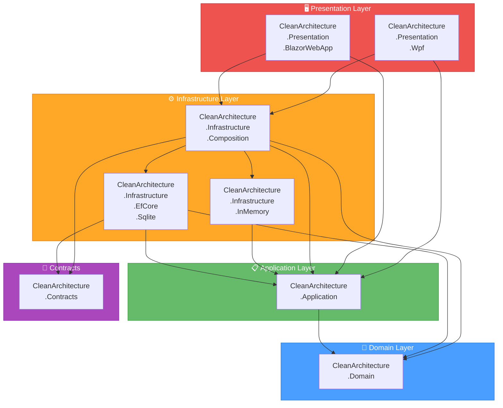

# Clean Architecture Example 

A complete example project demonstrating **Clean Architecture** principles implemented in C# (.NET 10).  
The goal of this repository is to provide a clear and educational foundation for building maintainable, scalable, and testable applications following clean software architecture patterns.

---

## Overview

This project illustrates how to structure a .NET application by separating business logic, infrastructure concerns, and user interface into distinct layers.  
It follows **Clean Architecture** and **SOLID** principles to ensure high maintainability, clear boundaries between layers, and easy testability.

The solution demonstrates how each layer interacts through well-defined contracts (interfaces), how dependencies flow only inward, and how implementation details (like databases or UI frameworks) can be swapped without touching the core domain logic.

---

## Architecture Layers

### **Domain Layer** (`CleanArchitecture.Domain`)
- Contains the *core business logic* and rules of the system.
- Includes **Entities**, **Value Objects**, **Aggregates**, and **Domain Events**.
- Implements **optimistic concurrency** via a `Version` / `OriginalVersion` token on aggregates.
- Has **no dependencies** on any external frameworks or technologies.
- Represents the *heart* of the application — pure C# classes with business meaning.

### **Application Layer** (`CleanArchitecture.Application`)
- Defines **Use Cases** that orchestrate domain logic to fulfill specific operations.
- Depends **only on the Domain layer**.
- Uses **interfaces (ports)** to communicate with the outer layers (e.g., persistence, UI).
- Contains DTOs, service interfaces, and business workflows.

### **Contracts Layer** (`CleanArchitecture.Contracts`)
- Shared configuration models and enums (e.g., `PersistenceProvider`, `PersistenceOptions`).
- Referenced by both Infrastructure and Presentation layers for provider selection.

### **Infrastructure Layer**
- Implements the technical details (adapters) required by the Application layer.
- **Pluggable persistence** — swap providers via configuration without changing business logic:

| Project | Description |
|---|---|
| `CleanArchitecture.Infrastructure.InMemory` | In-memory repositories for fast testing and demonstration |
| `CleanArchitecture.Infrastructure.EfCore.Sqlite` | EF Core + SQLite with optimistic concurrency tokens and **WAL mode** for concurrent access |
| `CleanArchitecture.Infrastructure.Composition` | Composition root — wires up DI, domain event dispatching, and provider selection |

### **Presentation Layer**
- Provides the **user interface** through two implementations:

| Project | Description |
|---|---|
| `CleanArchitecture.Presentation.Wpf` | WPF desktop application |
| `CleanArchitecture.Presentation.BlazorWebApp` | Blazor Server web application |

- Both UIs communicate with the Application layer through use case interfaces.
- Both can run simultaneously against the same SQLite database (WAL mode).

---

## Features

- Clean separation between **Domain**, **Application**, **Infrastructure**, and **Presentation** layers  
- **Pluggable persistence** — switch between InMemory and EF Core SQLite via configuration  
- **EF Core SQLite** with optimistic concurrency (`Version` token) and **WAL mode**  
- **Domain Events** for decoupled side effects within aggregates  
- **WPF** and **Blazor** UIs demonstrating interaction with Application use cases  
- **xUnit** test suite covering domain logic, use cases, infrastructure integration, and architecture rules  
- Strict dependency flow — outer layers depend on inner layers only  
- Modular and extensible structure ready for domain expansion  

---

## Architecture Diagram



> Dependencies flow **inward only** — Presentation → Infrastructure → Application → Domain.  
> The Domain layer has **zero** external dependencies.

---

## Technologies

- **.NET 10** / C# 14
- **EF Core** + **SQLite** (Infrastructure — persistence with WAL mode)
- **WPF** (Presentation — desktop)
- **Blazor Server** (Presentation — web)
- **xUnit** (Testing — unit, integration, and architecture tests)
- **Dependency Injection** for decoupling layers
- **Clean Architecture** & **SOLID** principles

---

## Solution Structure

```
CleanArchitecture.slnx
│
├── CleanArchitecture.Domain                              # Core business logic
├── CleanArchitecture.Application                         # Use cases & ports
├── CleanArchitecture.Contracts                           # Shared config models
│
├── CleanArchitecture.Infrastructure.InMemory             # InMemory adapter
├── CleanArchitecture.Infrastructure.EfCore.Sqlite        # EF Core SQLite adapter
├── CleanArchitecture.Infrastructure.Composition          # DI composition root
│
├── CleanArchitecture.Presentation.Wpf                    # WPF UI
├── CleanArchitecture.Presentation.BlazorWebApp           # Blazor Server UI
│
├── CleanArchitecture.Domain.UnitTests                    # Domain unit tests
├── CleanArchitecture.Application.UnitTests               # Application unit tests
├── CleanArchitecture.Infrastructure.InMemory.IntegrationTests
├── CleanArchitecture.Infrastructure.EfCore.Sqlite.IntegrationTests
├── CleanArchitecture.Presentation.Wpf.UnitTests          # WPF ViewModel tests
└── CleanArchitecture.ArchitectureTests                   # Layer dependency rules
```

---

## Getting Started

### Prerequisites

- [.NET 10 SDK](https://dotnet.microsoft.com/download/dotnet/10.0) or later

### Run the WPF application

```sh
dotnet run --project CleanArchitecture.Presentation.Wpf
```

### Run the Blazor application

```sh
dotnet run --project CleanArchitecture.Presentation.BlazorWebApp
```

### Run both simultaneously

Both apps default to EF Core SQLite with WAL mode and the same database file (`cleanarchitecture.db`).  
You can start both at the same time — WAL mode allows concurrent access:

```sh
# Terminal 1
dotnet run --project CleanArchitecture.Presentation.Wpf

# Terminal 2
dotnet run --project CleanArchitecture.Presentation.BlazorWebApp
```

### Switch persistence provider

Edit `appsettings.json` in the respective Presentation project:

```json
{
  "Persistence": {
    "Provider": "EfSqlite",
    "ConnectionString": "Data Source=cleanarchitecture.db",
    "DbFolder": "DbSqlite"
  }
}
```

Set `"Provider"` to `"InMemory"` to use the in-memory adapter instead (no database file needed).

### Run all tests

```sh
dotnet test
```

### Run specific test projects

```sh
# Domain unit tests
dotnet test CleanArchitecture.Domain.UnitTests

# Application unit tests
dotnet test CleanArchitecture.Application.UnitTests

# InMemory integration tests
dotnet test CleanArchitecture.Infrastructure.InMemory.IntegrationTests

# EF Core SQLite integration tests (includes WAL and concurrency tests)
dotnet test CleanArchitecture.Infrastructure.EfCore.Sqlite.IntegrationTests

# WPF ViewModel unit tests
dotnet test CleanArchitecture.Presentation.Wpf.UnitTests

# Architecture dependency rules
dotnet test CleanArchitecture.ArchitectureTests
```

---

## Purpose

This repository serves as a **reference implementation** for learning and experimenting with Clean Architecture in .NET.  
It demonstrates how to:
- Design a modular, decoupled architecture
- Structure code around **business capabilities**
- Separate core logic from framework dependencies
- Implement **optimistic concurrency** with EF Core
- Support **multiple UI frameworks** (WPF + Blazor) from the same core
- Write testable and maintainable C# applications

Use this as a starting point for your own projects or as a template to explore advanced topics like DDD, CQRS, or Event-Driven architectures.

---